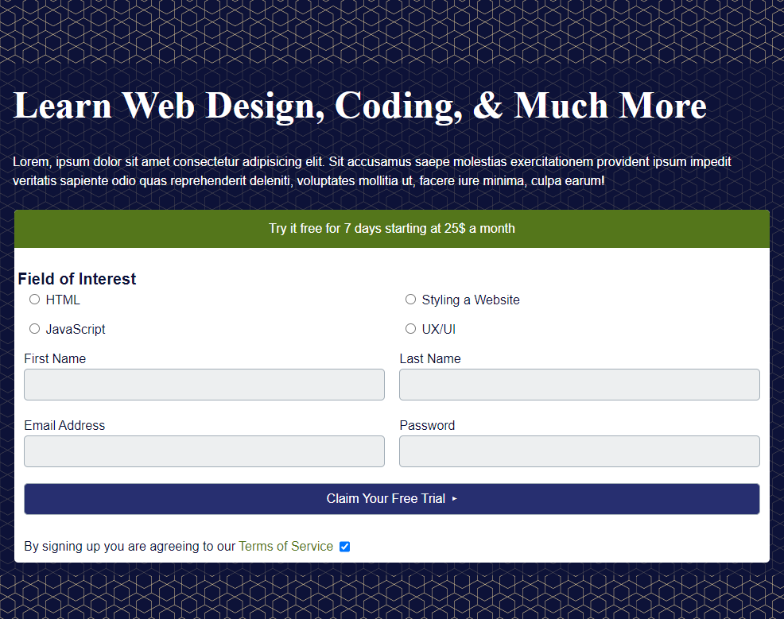

# In-class Build #4 - Responsive Form
This is a mentored build, thus follow the instructor's instructions/questions during the class block. You **MUST** be present in class to get a grade for this assignment. Being in attendance does not gaurantee you a grade for this assignment.

## Instructions to Finish off the Build
*  Add a checkbox and replace the paragraph "By signing up..." as the label. Research what a checkbox needs and add all the necessary attributes to that input.
*  The first breakpoint happens at 700px, that is when the form input fields go to 2 rows of 2 columns.
*  The second breakpoint happens at 1000px, that is when the form will become 650px wide and the heading and text will be on the left.
*  The last breakpoint happens at 1440px and the section will become fixed width and will not grow.

 
 
 

You may use the alternate, **brick-wall.svg**, version for the background (see screenshots provided with the provided files).
## Submission
You must have at least 2 commits of your build.

Zip (.zip) up the completed 'build-responsive-nav and upload to Moodle for marking. The working tree should be clean and all changes should be saved as a commit to GitHub Classroom. Be sure to use naming best practices for the zipped folder. The starting files for this build can be found here.

>>**Labs that do not follow best naming practices, or do not validate, will receive a 0. Late submissions will not be accepted!  You must be present in class in order to receive a grade for this assessment.**
